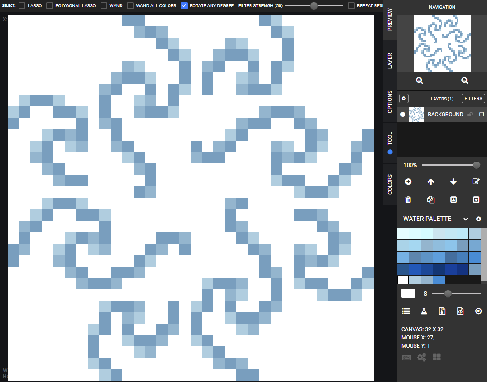

# david-kavenga.github.io

This website documents my learning progress in web development as part of the DevAcademy curriculum.

I hope to provide a detailed run-down of website features and style choices as well as notes for implementation.

## Contents
- [Blog pages](#Blog-pages)
  * [Identity and Values](#identity-and-values)
  * [Learning Plan](#learning-plan)
  * [CSS: Positioning](#css-positioning)
  * [Emotional Intelligence](#emotional-intelligence)
  * [JS: Basics and The DOM](#js-basics-and-the-dom)
  * [Neuroplasticity](#neuroplasticity)
  * [Problem Solving](#problem-solving)
  * [Foundations Reflection](foundations-reflection)
- [Respect the Tech](#respect-the-tech)
  * [Hello Penguin](#im-taking-this-penguin)
  * [Background](#theres-a-sea-in-my-bedroom)
  * [Colour Scheme](#on-colour)
  * [Calculator](#calculator)
  * [JavaScript Carnival](#javascript-carnival)
- [Site Planning](#site-planning)

<br>

---
## Blog pages
---
### Identity and values
An exploration of what makes me the person I am, and how it may impact my journey at EDA.

Further reading:
  - [High5 Strengths Test](https://high5test.com/test/)
  - [16 Personalities Test](https://www.16personalities.com/infp-personality) (Myers-Briggs Type Indicator)
  - [The DOPE Test](https://high5test.com/test/)
  - [Taka's 'Don't bother others' blogpost](https://note.com/g_2/n/naccf80cb2d48) (Japanese)

---
### Learning Plan
How I intend to operate within the context of the Dev Academy Foundations and Bootcamp Programme. Negotiated with peers and facillitators.

---
### CSS: Positioning
A tutorial on using various positioning types in CSS and how to manipulate elements with them.

---
### Emotional Intelligence
A short study on EQ and small reflection of how it impacts my learning at EDA

Further reading:
  - [What you need to know](https://www.healthline.com/health/mental-health/time-for-some-self-reflection#Tips-for-self-reflection)
  - [Emotional Intelligence in Leadership](https://www.mindtools.com/pages/article/newLDR_45.htm)
  - [Emotional Intelligence and Myers-Briggs](https://ei4change.com/wp-content/uploads/2017/09/Emotional-Intelligence-and-the-MBTI.pdf)

---
### JS: Basics and The DOM
An overview of JavaScript and the DOM in a non-technical frame. How I see the interactions between HTML, CSS, JS and the DOM.

---
### Neuroplasticity
Another short study, this time one Neuroplasticity and the Growth Mindset. I reflect on what this means for my learning and how it relates to my previously created Learning plan.

Further reading:
  - [Synaptic Pruning](https://www.pnas.org/content/117/28/16096)
  - [Fixed vs. Growth: The Two Basic Mindsets That Shape Our Lives](https://www.themarginalian.org/2014/01/29/carol-dweck-mindset/)
  - [The Habits of Successful People](https://buffer.com/resources/the-habits-of-successful-people-they-have-a-growth-mindset/)
  - [MindSet Works](https://www.mindsetworks.com/science/)
  - [Incorporating Growth Mindset](https://www.edutopia.org/article/incorporating-growth-mindset-into-teaching-practice-donna-wilson-marcus-conyers)

---
### Problem Solving
How to solve problems 101. A description of different problem solving methods and what personally works for me.

Further reading:
  - [Rubber Ducky Method](https://makersacademy.medium.com/what-is-rubber-duck-debugging-d3028d70a707#:~:text=Rubber%20duck%20debugging%20is%20a,%2Dline%2C%20to%20that%20duck.)
  - [How to read error messages](https://www.gustavwengel.dk/googling-error-messages-1)

---
### Foundations Reflections
A look into my experience with the foundations portion of DevAcademy.

<br>

---
## Respect the Tech
Here we explore tricks used to create certain elements of the site.

---

### I'm taking this penguin

A waving penguin used in part of the Responsive Web Development CSS intro course from freecodecamp.org.
It is displayed on the demo page using a small `<iframe>` with no border. The penguin itself is made using CSS and HTML, using CSS variables to provide an easy way to change colours.

```CSS
.right-hand {
    top: 5%;
    left: 25%;
    background: var(--penguin-skin, black);
    width: 30%;
    height: 60%;
    border-radius: 30% 30% 120% 30%;
    transform: rotate(130deg);
    z-index: -1;
    animation-duration: 3s;
    animation-name: wave;
    animation-iteration-count: infinite;
    transform-origin:0% 0%;
    animation-timing-function: linear;
  }

  @keyframes wave {
      10% {
        transform: rotate(110deg);
      }
      20% {
        transform: rotate(130deg);
      }
      30% {
        transform: rotate(110deg);
      }
      40% {
        transform: rotate(130deg);
      }
    }
```
This shows some of the key rules which dictate the movement of the penguin's right hand. Animation duration, name, iteration count, transformation origin and timing function are defined. `@keyframes` defines rules for the animation. In this case, the arm is rotated four times during the animation. The percentages correspond to how far through the animation (of the total 3s) the transformation occurs.

<br>

---

### *There's a Sea in my Bedroom*

One of my first books. I've always loved the sea and one of my favourite pieces of art is *'The Great Wave'*. In Japan, I lived not too far from the famous *Naruto whirlpools* and found them fascinating. I wanted to bring these things together and make the sea a part of my site. After some time mucking around, and a few outright failures, I have a background I'm happy with (for now!). Here is some of the process behind it's creation.

#### PixilArt

[Pixilart tessalation](https://www.pixilart.com/draw/tessellation-85b984c22d)
is amazing for creating a tiling pattern. Checking `Tile Mode` at the bottom of the page allows you to see your art rendered next to itself as a tile. Awesome for previewing what a background tile will look like.

I needed a square to tile, so I went with a 32*32 canvas. Some tutorials on pixel art styles led me to this very basic wave in three colours. It's my first pixel art creation!

<p align="center"></p>

Repeating via rotation and wrapping left-right top-bottom for a whirlpool look.

<p align="center"></p>

Tile Mode shows too much whitespace, which clearly shows tiles are repeating squares.

<p align="center"></p>

Add further repetitions of wave parts to minimise whitespace. The corner pieces make the same eddy shape as the one in the center when tiled. This helps break the perception of the tiles as squares in a grid.

<p align="center"></p>

Done!

<p align="center"></p>

However, the tile itself is a bit busy to go on the website as is. I'd like it to be fainter as well as change the white to a softer colour. After some searching, I learned it is possible to do all that without going back and editing pixel by pixel.

#### Enter Gradients:

```CSS
background: linear-gradient(0deg, 
rgba(150, 180, 250, 0.75), 
rgba(19, 57, 139, 0.75)), 
url(../resources/pixil-frame-complex.png); /* made it myself! */
```
A few stages to break down:
1. The `background` property allows for multiple images. These are automatically overlaid on top of each other. The last element goes on the bottom, second to last above that, and so on.
2. `linear-gradient` takes two colours and a direction as arguments. CSS treats the result as an image.
3. Because there are two 'images' in the background definition, it automatically overlays the gradient on the tile. Here the 'alpha' channel of the chosen colours becomes important. A solid colour gradient would completely cover anything underneath.
4. The tile auto-repeats as if it was used individually, but the gradient fills the current container. In this case, the entire body box.

<p align="center"></p>

Magic :)

Sadly, this trick might not be supported in internet explorer, so the site has a back-up background colour defined as well.

<br>

---

### On Colour

Choosing a colour-palette for different areas of the website was initially daunting, but one of my peers posted a link to a very simple and useful tool for quickly getting a set of colours that complement eachother. This site is called [Coolors](https://coolors.co/).

Normally, when creating a new colour scheme, I have in mind a specific idea that serves as the centrepiece for the rest of the colours.

* For the website itself, this was the [sea and horizon](https://coolors.co/ffc914-33658a-1ca9c9-28112b-dc602e).


* For my calculator, it was a little [Donkey Kong](https://coolors.co/a63a50-f0e7d8-19323c-a1674a-ba6e6e).

* And for my [minesweeper](https://david-kavenga.github.io/minesweeper/) game, it was a [music video](https://coolors.co/fff07c-1f271b-08a045-665687-ef476f) from my favourite artist at the moment.
<p align="center"></p>

I've made a small habit of adding a link to the colorschemes in my css files, so that I can both easily see the colours next to eachother, but also copy the hex codes quickly.

<br>

---

### Calculator

For this project, I created a calculator from pseudocode derived from freeCodeCamp's [example calculator](https://codepen.io/freeCodeCamp/pen/EPNZYW). There are still some steps to get it functional enough to pass the tests at [freeCodeCamp](https://www.freecodecamp.org/learn/front-end-development-libraries/front-end-development-libraries-projects/build-a-javascript-calculator), but the current iteration is a working calculator.

I had some difficulties in creating the calculator, some of which I'll detail below, along with the solution I came up with.

<br>

#### Buttons

As with the example calculator, i wanted to have my calculator buttons arranged like a simple dollar-store calculator. This meant having 5 rows of 5 buttons, but making the addition button cover two rows.

My original solution split the button elements on the HTML page into different div containers, declaring the positioning of the plus button to be absolute with an offset, and all the other buttons aligned left-wards so that they moved out of the way. This was perfectly viable for a static calculator, but I also wanted to have the ability to resize my view. As I did, the plus button 'travelled'.

Solving this required switching to a grid layout and specifying that the plus button cover two rows. It's amazing how little time this took to do compared to the countless hours I spent late on a Saturday night trying to manually adjust pixel multipliers in the original solution.

However, there was still work to be done getting the grid to appear correctly on Safari browsers. It turns out Safari doesn't like percentage sizes for dynamically sized elements. This caused my buttons to slide off the calculator on iPhones.}

Thankfully, because I knew i had solid scaling variables, I could just set the grid container to a known width and that fixed the display issue.

<br>

#### Evaluation

The freeCodeCamp solution to storing input and evaluating it when the '=' button is pressed meant that the expressions were evaluated with Immediate Execution Logic. This was fine for the initial build as proof of concept, but I wanted my calculator to be able to handle a little more and use Expression Logic instead.

Searching around the internet, and with some advice from pairs, I eventually found the `Function` constructor in JavaScript would allow for the evaluation of a string of inputs. Apparently, the `eval()` function, while doing the same thing, in JavaScript can be a bit risky to use.

From there I tried to solve a problem with floating point precision 5.6 + 2.1 should not equal 7.699999999 on a simple calculator! Here, the `parseFloat()` and `.toFixed()` inbuilt methods were invaluable.

For huge numbers too big for the screen, I decided I wanted scientific notation. Looking around for a method I found `.toExponential()` which allowed me to set a number of digits. I checked my result's length for each calculation and ran toExponential each time the number of digits exceeded 15 (what the display can comfortably hold).

Lastly, to get the calculator to it's current form, I added edge-case checks for incorrect expression inputs. Thank you to everyone who tested my calcultor and pointed these edge cases out to me!

<br>

---

### JavaScript Carnival

A fun set of projects where the HTML, CSS and resources were provided to us and we then wrote JS to make the activities function

The three activities were:
* [Inflate the Balloon](#inflate-the-balloon)
* [Whack-a-mole](#whack-a-mole)
* [Dress the clown](#dress-the-clown)

<br>

#### Inflate the Balloon

Switch between images of a balloon being blown up by a unicorn when clicked. Display a message and sound when the balloons are inflated.

During the creation of this activity, I realise that HTML element objects can be stored in arrays like any other Javascript object. Learning how to get the target of an event listener and matching that to the pre-existing array with `.find` allowed me to update the correct unicorn's images.

Attaching the speech bubbles to the Unicorns as the spoke was done using `.getBoundingClientRectangle` on the clicked unicorn's img element and then setting that as the left and top values for an `absolute` positioned text-box gif.

<br>

#### Whack-a-mole

Create a whack-a-mole game with scoring and random mole placement.

In this activity, I started by creating an array of cells, and writing a placeMole function to put the mole in a random location. The mole image element is created and destroyed each time the mole moves.

Then I created an interval to also move the mole every second. Currently this can cause the mole to move a little erratically, if the interval is soon after a click on the mole, but it makes for a good amount of frustration as the missed mole plays a "neener neener" type audio clip.

<br>

#### Dress the clown

Allow the user to select bodyparts with the up and down arrows, then cycle between clothing with the left and right arrows to dress the clown as they desire. Add a screenshot feature to save the resulting outfit.

Simple functions control whether the bodypart index or clothingpiece indexes change or not, and the current image is set to a source derived from both bodypart name and index.

The toughest part of creating this activity was to use `HTML2Canvas` and figure out that the parent cell needed to actually be bigger than the elements inside it to capture all the contents in an image.

<br>

---
## Site Planning
A website doesn't just appear spontaneously. Some key questions needed answering.

---
### What is my site's primary purpose?
To provide an environment for exploring learning concepts from the DevAcademy course. To provide proof of my abilities, but also my progress. In other words, the site's purpose is to be a snapshot of my journey.

### Who is my audience? (is it kids, adults, academics)?
My peers and facilitators at DevAcademy, but also all users of GitHub. Because the site represents my work, I want anyone potentially interested in my work to be the target audience.

### How will I build my site to support their user experience?
I will use what I've learnt about accessibility, semantic structure, and responsive design to create a site that is maximally compatible for all users. The experience difference should be seamless between mobile and desktop as well as between sighted users and those with disability.

Letting more jarring aspects of the site (experiments or fun things) sit in their own separate space will allow for a smoother experience.

### Wireframe - can I draw my site layout on paper? Draw it!

Two separate layouts for desktop/mobile devices

<p align="center"><b>Mobile use flow</b><br>
</p>

The objective is to keep the navigation bar tucked in the hamburger menu at the top left of the screen. The Banner and hamburger menu will float with the rest of the page (unlike desktop version).

<p align="center"><b>Desktop Home</b><br>
</p>

Use of the site is intended to be as simple and as intuitive as possible. For navigation, a click on 'Home' or 'About' takes the user directly to those pages. Hovering on any of the nav bar buttons changes the colour and displays the dropdown, if any.

<p align="center"><b>Desktop Blog X Example</b><br>
</p>

The current page remains highlighted with the hover colour. This image doesn't show it, but the banner will adjust it's title based on the page the user is on.

### What other directories do I need (e.g images)? Where do I put that directory?
As the whole site will be created with blog posts in mind, I will need to make use of a blog directory to keep track of the individual pages. Blog posts sometimes need images, so they will be stored in something like `blog/images`. If using images becomes a regular occurrence, it might be good to further divide the images into specific blog page directories.

For the home page, I'd like to keep the structure similar. All necessary linked files can sit in their own directory `./resources`.

### Do I want the style to be applied to your blog entries also?
I think it is fine for the homepage to depart from the rest of the website, but some elements should remain consistent for ease of use. The Navigation bar, for example will be on all pages, in full or reduced form depending on the user device. I'd like for the background colour/pattern to stay consistent as well as text colour/link style. No scrolling for the home page if possible. It just needs to be a simple, clean representation of the site, with handy links.
